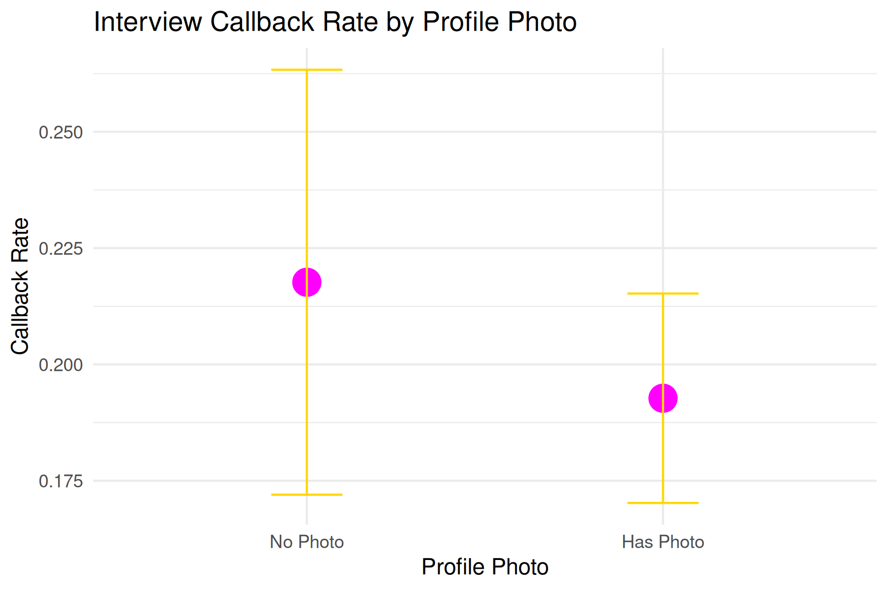

# LinkedIn Profile Photos and Recruiter Visibility: A Simulation Study

This project simulates LinkedIn profile data to investigate whether the presence of a profile photo influences recruiter behaviour.

A synthetic dataset (n = 1500) was designed to evaluate the effect of profile photos on recruiter visibility and engagement. Logistic and linear regression models were applied to test the hypothesis while accounting for multiple confounding variables.

The project demonstrates the ability to generate, clean and analyse complex datasets using R.

## Project Context
This project was inspired by the author’s decision not to include a profile photo on professional platforms, motivating an exploration of whether profile photos meaningfully influence recruiter visibility and engagement using simulated LinkedIn profile data.

## Methods
- Simulated dataset of 1500 profiles
- Logistic regression (glm) for interview callbacks
- Linear regression (lm) for recruiter profile views

## Key Variables
- has_profile_photo
- years_experience
- perceived_attractiveness_score
- education_level
- university_prestige
- profile_completeness
- connections_count
  
## Tools
- R
- ggplot2

## Visualisations
See the PNG plots included in the repository.

## Insight
Simulation shows that LinkedIn profile photos do not significantly increase visibility or recruiter engagement. While profiles with photos may appear more complete, recruiter callbacks are largely unaffected, suggesting LinkedIn is better suited for networking than formal hiring.

However, visible photos can also introduce applicant-side bias: candidates may form opinions about hiring managers based on appearance. For example, assumptions about age, professionalism or personality which could influence whether they apply or how they approach the role.

Overall, photos on LinkedIn affect social perception more than formal hiring outcomes and highlight the potential for bias on both sides.

## Limitations  
The dataset is simulated and may not fully reflect real-world LinkedIn behaviour. The simulation only incorporates a subset of features (e.g., profile photo, connections, education) and does not account for other biases such as ethnicity or network effects. Randomised components introduce stochasticity, which may exaggerate or underestimate outcomes and temporal trends are not modelled as the data is static.
